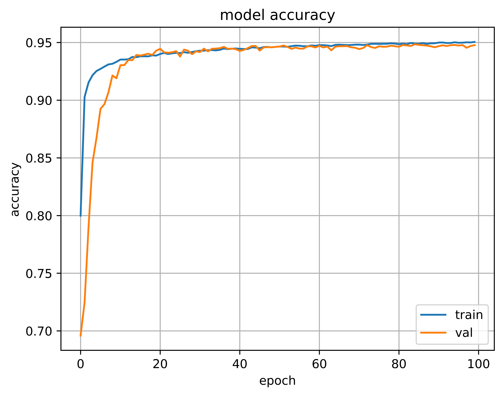

<div align="center">
  <a href="https://github.com/tensorflow/tensorflow">
    
  </a>
  <a href="https://keras.io/">
    
  </a>
</div>

<hr />

# Retinal Vessel Segmentation

## Introduction
Implementing an Autuencoder architecture neural network for segmentation of cropped patches of the grayscaled retinal image


## Autoencoder


Autoencoder, or an "hourglass" model, is a simple extension of the previously mentioned image classification model. The process of obtaining the compressed feature shares the same concept of abstraction path introduced in the classification model. The compressed feature is then propagated to the expansion path, which de-compresses the compressed feature back to the spatial representation of the image. In this arrangement, the compressed feature is often called the "Bottleneck" feature.


Autoencoder architecture is used to build a model that can learn to produce a segmentation mask from the input image. Intuitively, the output of the autoencoder is expected to be the predicted segmentation mask. During training, the loss will be computed between the real label mask and the predicted mask.

## Result
<div align="center">
  <a href="model.py">
	  
  </a>
</div>

## Run Code
```
$ python3 main.py
```
